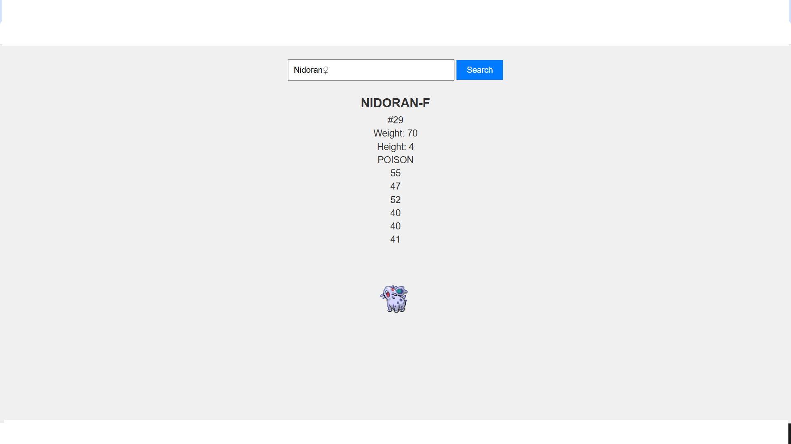

# Pokémon Search

## Overview

Pokémon Search is a web application that allows users to search for Pokémon by name or ID. The application fetches data from the Pokémon API and displays detailed information about the Pokémon, including its stats, types, and sprite image.

## Features

- Search for Pokémon by name or ID
- Display Pokémon name, ID, weight, height, stats, and types
- Show Pokémon sprite image
- Handle special cases for Pokémon with special characters in their names

## Technologies Used

- HTML
- CSS
- JavaScript
- [Pokémon API](https://pokeapi.co/)

## Getting Started

### Prerequisites

- A modern web browser

###